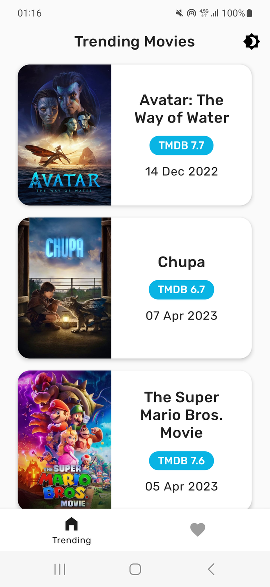
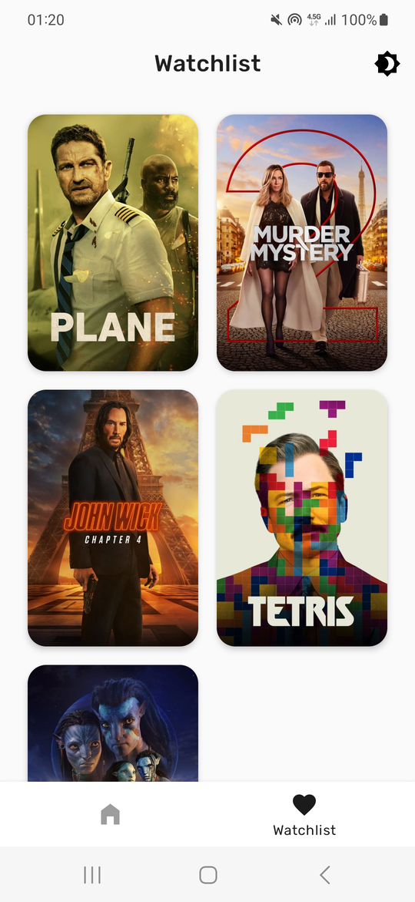
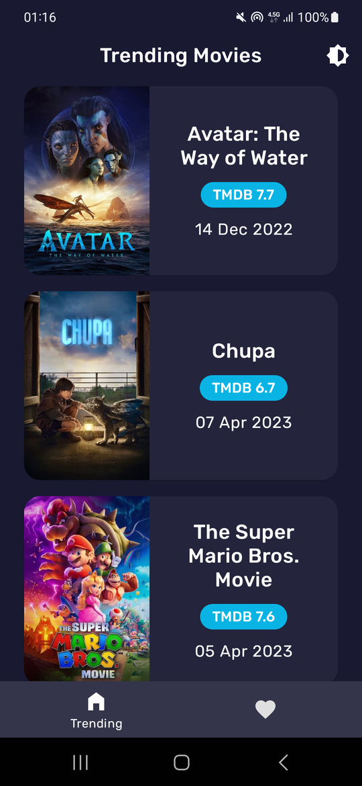
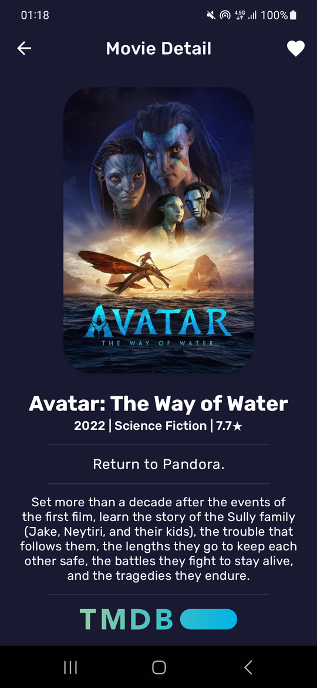
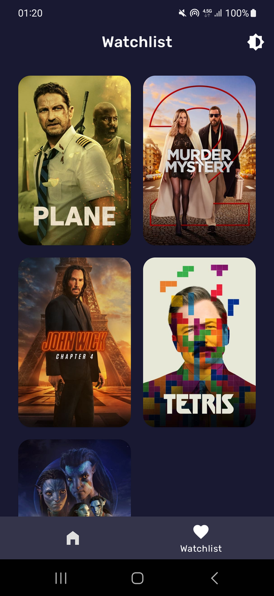
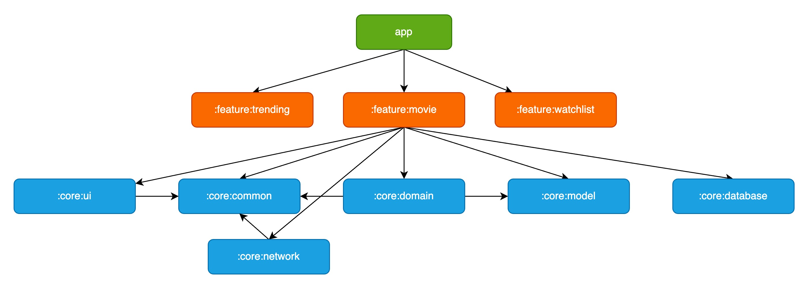

# Movie App   


## Try it

[Click here to run the app in your browser](https://appetize.io/app/ymttbar3podujcoyoecgzyuah4)

## Features

- Clean architecture with MVVM
- A single-activity architecture, using the nested Navigation graph
- Modular architecture
    - Migrated from single module structure. Check [related PR for migration](https://github.com/azizutku/Modular-Clean-Arch-Movie-App/pull/3)
- Composite builds with convention plugins
    - Migrated from buildSrc. Check [related PR for migration](https://github.com/azizutku/Modular-Clean-Arch-Movie-App/pull/2)
- Baseline Profiles and Macrobenchmark
- Version Catalogs
- Supporting fully offline usage with Room
- Pagination from Local and Remote (RemoteMediator) and only from Local
- Dependency injection with Hilt
- Dark and Light theme
- Kotlin Coroutines and Flows
- Kotlinx Serialization
- New SplashScreen API
- Different product flavors (dummy)
- Unit tests for ViewModels and data layer and tests for Room.
- Deep links

## Screenshots

| Mode  | Recent Launches| Launch Details| Favorites |
|-|-|-|-|
| Light |  |  |  |
| Dark  |   |   |   |

## Modularization
The project is divided into feature and core modules, following the rule: if a class is needed only by one feature module, it should remain within that module. If not, it should be extracted into an appropriate core module. The feature modules operate independently and cannot access each other, so deep links are used to navigate to destinations located in other modules.

 

## Navigation
When feature modules are compiled, they work in isolation and cannot access each other, making it impossible to navigate to destinations in other modules using IDs. To address this, deep links are used to enable direct navigation to a destination feature. This ensures that users can access features located in different modules without any issues.

## Baseline Profiles
The app's baseline profile is located in the `app/src/main/baseline-prof.txt` directory, and is responsible for allowing the Ahead-of-Time (AOT) compilation of the app's critical user path during launch. To generate baseline profiles, run the following Gradle command in your terminal:
```
gradle :benchmark:pixel4Api31AospProdBenchmarkAndroidTest --rerun-tasks -P android.testInstrumentationRunnerArguments.class=com.azizutku.movie.benchmark.baselineprofile.BaselineProfileGenerator
```

Afterward, you need to copy the content of the output file located at `benchmark/build/outputs/managed_device_android_test_additional_output/flavors/prod/pixel4Api31Aosp/BaselineProfileGenerator_generate-baseline-prof.txt` and paste it into the `app/src/main/baseline-prof.txt` file.

### Macrobenchmark
In order to measure the performance of the app's critical user path during launch, the Baseline Profiles feature is used in conjunction with the Macrobenchmark tool.
> Note: Run benchmark tests on a real device, and perform benchmarks on a Release build to measure performance in real-world scenarios.

## Tech stack

### Dependencies

-   [Jetpack](https://developer.android.com/jetpack):
    -   [Android KTX](https://developer.android.com/kotlin/ktx.html)
    -   [AndroidX](https://developer.android.com/jetpack/androidx)
    -   [View Binding](https://developer.android.com/topic/libraries/view-binding/)
    -   [Lifecycle](https://developer.android.com/topic/libraries/architecture/lifecycle)
    -   [Navigation](https://developer.android.com/guide/navigation/)
    -   [Paging 3](https://developer.android.com/topic/libraries/architecture/paging/v3-overview)
    -   [Room](https://developer.android.com/topic/libraries/architecture/room)
    -   [ViewModel](https://developer.android.com/topic/libraries/architecture/viewmodel)
-   [Coroutines](https://kotlinlang.org/docs/reference/coroutines-overview.html)
-   [Hilt](https://dagger.dev/hilt/)
-   [Kotlinx Serialization](https://github.com/Kotlin/kotlinx.serialization)
-   [Glide](https://github.com/bumptech/glide)
-   [Timber](https://github.com/JakeWharton/timber)
-   [Lottie](https://github.com/airbnb/lottie-android)
-   [Chucker](https://github.com/ChuckerTeam/chucker)
-   [SplashScreen API](https://developer.android.com/guide/topics/ui/splash-screen)

Please refer to [`lib.versions.toml`](https://github.com/azizutku/Modular-Clean-Arch-Movie-App/blob/main/gradle/libs.versions.toml) to see all dependencies.

### Test dependencies

-   [JUnit](https://github.com/junit-team/junit4)
-   [Turbine](https://github.com/cashapp/turbine)

### Plugins

-   [Detekt](https://github.com/arturbosch/detekt)
-   [Ktlint](https://github.com/pinterest/ktlint)
-   [Jacoco](https://github.com/jacoco/jacoco)
-   [Gradle Version Plugin](https://github.com/ben-manes/gradle-versions-plugin)

To run detekt use `detekt` task.

To run ktlint use `ktlintCheck` task.

To generate coverage report with Jacoco run `jacocoTestDevDebugUnitTestReport` task. It will generate report to `build/reports/jacoco` folder.

To check depedency updates run the following Gradle command in your terminal:
```
gradle dependencyUpdates -Drevision=release
```

### Code style

This project uses [detekt](https://github.com/detekt/detekt) and [ktlint](https://github.com/pinterest/ktlint) to perform static code analysis.

It has also pre-commit git hook to verify that all static analysis and tests pass before committing.
Run `installGitHooks` task to use pre-commit git hook

## Configuration
In order to build successfully, you will need to provide an TMDB API key. This key is used to access data from the API service that the project relies on. To provide the API key, you should add the following line to your local.properties file:
```
tmdb.api.key=YOUR_API_KEY
```
To obtain an API key, follow the instructions provided at https://www.themoviedb.org/settings/api.

## Improving Performance with Baseline Profiles
#### Startup Performance (with 5 iterations)

| Startup Mode           | Compilation Mode          | Min (ms) | Median (ms) | Max (ms) |
| ----------------------| --------------------------| ---------| ------------| ---------|
| Cold                   | NoCompilation             | 251.7    | 256.0       | 274.6    |
|                        | Partial with<br>Baseline Profiles | 223.5&nbsp; ⬇ <br> (-11.2%) | 226.4&nbsp; ⬇ <br> (-11.6%)  | 240.4&nbsp; ⬇ <br> (-12.5%) |
| Warm                   | NoCompilation             | 91.6     | 101.0       | 123.6    |
|                        | Partial with<br>Baseline Profiles | 80.9&nbsp; ⬇ <br> (-11.7%) | 87.0&nbsp; ⬇ <br> (-13.9%) | 115.2&nbsp; ⬇ <br> (-6.8%) |
| Hot                    | NoCompilation             | 58.4     | 62.8        | 86.9     |
|                        | Partial with<br>Baseline Profiles | 51.5&nbsp; ⬇ <br> (-11.8%) | 56.9&nbsp; ⬇ <br> (-9.4%) | 100.0&nbsp; ⬆ <br> (+15.1%) |

#### Trending Screen Performance (with 5 iterations)

| Startup Mode                    | SubMetric             | P50      | P90      | P95      | P99     |
| --------------------------------| ----------------------| ---------| --------| ---------| ---------|
| NoCompilation                   | frameDurationCpuMs    | 3.1      | 7.5     | 13.4     | 20.9     |
|                                 | frameOverrunMs        | -3.9     | 1.2     | 7.1      | 14.9     |
|Partial with<br>Baseline Profiles   | frameDurationCpuMs    | 3.2&nbsp; ⬆ <br> (+3.2%)      | 5.5&nbsp; ⬇ <br> (-26.7%)     | 6.7&nbsp; ⬇ <br> (-50.0%)      | 13.5&nbsp; ⬇ <br> (-35.4%)     |
|                                 | frameOverrunMs        | -3.6&nbsp; ⬆ <br> (+0.3)     | -1.4&nbsp; ⬇ <br> (-2.6)    | 1.3&nbsp; ⬇ <br> (-5.8)      | 7.1&nbsp; ⬇ <br> (-7.8)     |
